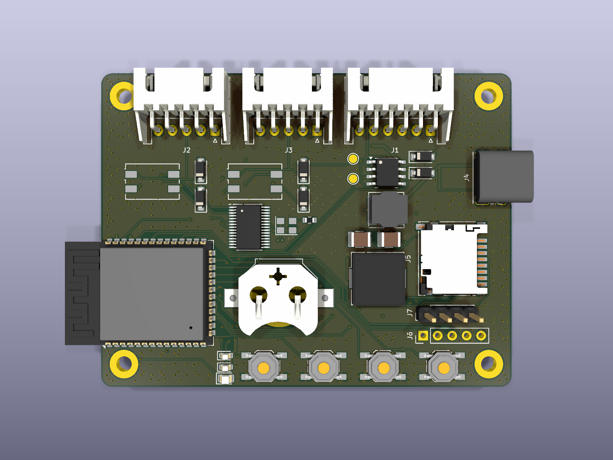
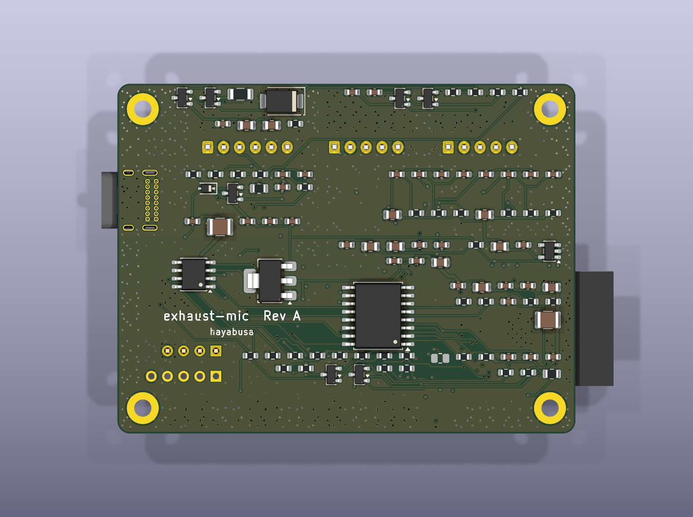
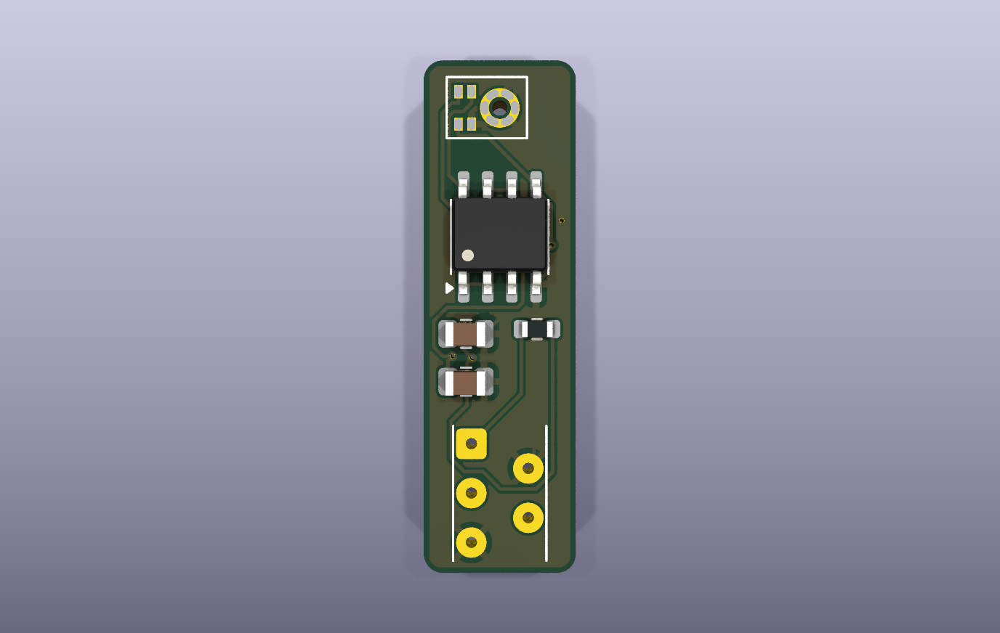
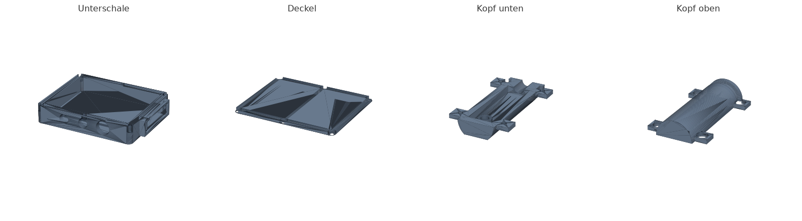

# Exhaust-Mic

**Zweikanaliger 24-Bit-Tonrekorder für Motor- und Auspuffgeräusche.**
Zwei Mikrofonköpfe mit 135 dBSPL Grenzschalldruck an einem Stereo-ADC,
aufgezeichnet von einem ESP32-S3 auf microSD — mit Zeitstempeln, die sich
im Schnittprogramm von selbst auf das Videomaterial legen.

Gebaut für eine Suzuki Hayabusa: Kopf A am Endrohr, Kopf B in der Airbox.



---

## Auf einen Blick

| | |
|---|---|
| Kanäle | 2 × differentiell, 135 dBSPL Grenzschalldruck |
| Wandler | PCM1863, 24 Bit, 48 kHz, 110 dB Störabstand |
| Rechner | ESP32-S3-WROOM-1-N8R2, WLAN und Bluetooth LE |
| Speicher | microSD, WAV mit BWF-Zeitstempel |
| Zeitbasis | DS3231-TCXO, ±2 ppm, Sekundenanker auf die Samplenummer |
| Fahrzeug | CAN über SN65HVD230, Zündungs- und Bordnetzerkennung |
| Versorgung | 12 V Bordnetz, LM5164-Abwärtswandler, Verpolschutz |
| Hauptplatine | 72 × 55 mm, vier Lagen, beidseitig bestückt |
| Mikrofonkopf | 8 × 27 mm, zwei Lagen, 2× identisch |
| Gehäuse | fünf gedruckte Teile, Rundschnurdichtung |
| Bauteilkosten | rund 65 € Hauptplatine, 4 € je Mikrofonkopf |

## Bilder

| Hauptplatine, Rückseite | Mikrofonkopf |
|---|---|
|  |  |

Alle Kabelstecker sitzen an der oberen Kante und zeigen nach außen, USB-C
und microSD liegen rechts hinter einer gemeinsamen Serviceklappe,
Leuchtdioden und Taster an der unteren Kante. Auf der Rückseite steht
nichts über 2,7 mm — der Aufbau bleibt mit 11,9 mm flach.



## Wie das Signal läuft

```
Mikrofonkopf (2×)                    Hauptplatine
┌──────────────────────┐             ┌───────────────────────────────────┐
│ IM73A135  135 dBSPL  │  2× Twisted │  Gleichtaktdrossel + Klemmdioden  │
│   ↓                  │  Pair,      │        ↓                          │
│ OPA2325 Impedanz-    │──geschirmt──│  PCM1863  24 Bit / 48 kHz         │
│ wandler, 2,8-V-LDO   │  4 m        │        ↓ I²S                      │
└──────────────────────┘             │  ESP32-S3 ──► microSD (WAV/BWF)   │
                                     │        ↑                          │
                                     │  DS3231 1 Hz ─ Sekundenanker      │
                                     └───────────────────────────────────┘
```

Der Wandler ist Taktherr und hängt an einem eigenen 24,576-MHz-Oszillator;
der ESP32 empfängt nur. Die Sekundenflanke der Uhr latcht den laufenden
Samplezähler — das ergibt eine driftfreie Zuordnung Wanduhrzeit ↔ Sample
über die ganze Aufnahme, unabhängig vom Abtastratenfehler.

## Stand

| | Mikrofonkopf | Hauptplatine |
|---|---|---|
| Größe | 8 × 27 mm | 72 × 55 mm |
| Bauteile | 14 | 127 |
| Leiterbahnen | 120 (199 mm) | 1047 (3236 mm) |
| Durchkontaktierungen | 7 | 919 |
| Offene Verbindungen | **0** | **7** |
| DRC-Fehler | **0** | **0** |
| ERC-Fehler | **0** | **0** |
| Schaltplanparität | **0** | 4 (Bohrungen) |
| Bauhöhe oben / unten | 1,8 / 1,5 mm | 7,6 / 2,7 mm |

Der Mikrofonkopf ist fertig. Auf der Hauptplatine bleiben **sieben
Verbindungen offen** — vier Masseflächen-Stücke und drei Pads, kein
Signalnetz. Sie sind in KiCads interaktivem Router in wenigen Minuten zu
schließen und müssen vor der Fertigung geschlossen sein.

Beschaffung: 71 von 75 Positionen haben eine bei DigiKey lagernde
Herstellernummer. Offen ist nur MK1 — das IM73A135V01XTSA1 ist aktiv, bei
DigiKey aber ohne Bestand; andere Distributoren führen es.

> **Nichts davon ist bisher aufgebaut worden.** Geprüft sind DRC, ERC,
> Schaltplanparität, eine eigene Abnahme und der Übersetzungslauf der
> Firmware — keine Messung an echter Hardware.

## Was im Repository liegt

| | |
|---|---|
| `*.kicad_sch`, `exhaust-mic.kicad_pcb` | Hauptplatine, sechs Blätter |
| `mic-head/` | eigenes Projekt für den Mikrofonkopf |
| `lib/` | Symbole und Landmuster, die KiCad nicht mitbringt |
| `firmware/` | ESP-IDF-Firmware |
| `output/` | Stücklisten, Gerber, PDF, STEP/STL, Bilder |
| `docs/` | Beschaffung, Gehäuse, Entwicklungsnotizen |

Schaltplan, Layout, Gehäuse und die Pinbelegung der Firmware werden
**erzeugt, nicht von Hand gepflegt**. Jede Gehäuseöffnung und jeder GPIO
in der Firmware stammt aus der Platinendatei — wandert ein Stecker,
wandert alles mit. Das hat sich mehrfach ausgezahlt: die Stecker sind in
diesem Projekt zweimal komplett umgezogen.

## Selbst erzeugen

```sh

# Firmware
. ~/esp/esp-idf/export.sh
cd firmware && idf.py set-target esp32s3 && idf.py build
```

⚠️ **Die Dateien auf der Platte sind weiter als die Generatoren.** In den
Schaltplänen stecken Beschaffungsfelder, korrigierte Landmuster, zwei
reparierte Symbole und fünf PWR_FLAG, die `build_main.py` überschreiben
würde. Vor einem Neulauf lesen: [`docs/entwicklung.md`](docs/entwicklung.md).

## Weiterlesen

| | |
|---|---|
| [`docs/beschaffung.md`](docs/beschaffung.md) | Bauteilwahl über die DigiKey-Schnittstelle, Ersatztypen, Bestand |
| [`docs/gehaeuse.md`](docs/gehaeuse.md) | Maße, Dichtkonzept, Filamentwahl, Temperaturgrenze am Endrohr |
| [`docs/entwicklung.md`](docs/entwicklung.md) | Werkzeugfallen, Leiterbahnbreiten, Prüfung, Schaltplan gegen Platine |
| [`firmware/README.md`](firmware/README.md) | Firmware, GoPro-Kopplung, Stand gegen die Anforderungen |
| [`docs/specs/…`](../../docs/specs/2026-08-28-exhaust-mic-design.md) | Auslegung, Rauschbudget, Pegelplan |

## GoPro

Der Rekorder hängt sich über Bluetooth LE an die Open-GoPro-Schnittstelle
und meldet sich für den Kamerastatus an: **Video starten heißt Aufnahme
starten**, Stopp heißt Stopp. Der Taster am Gerät löst umgekehrt die
Kamera aus.

⚠️ Die Platine kann der Kamera **keinen Ton liefern**. Der ESP32-S3
beherrscht nur Bluetooth LE, GoPro nimmt drahtlosen Ton aber über HFP an —
ein Bluetooth-Classic-Profil. Und HFP wäre einkanalig mit 8 oder 16 kHz,
also das Gegenteil dessen, wofür diese Platine gebaut ist. Einzelheiten
und die zwei Auswege in [`firmware/README.md`](firmware/README.md).
